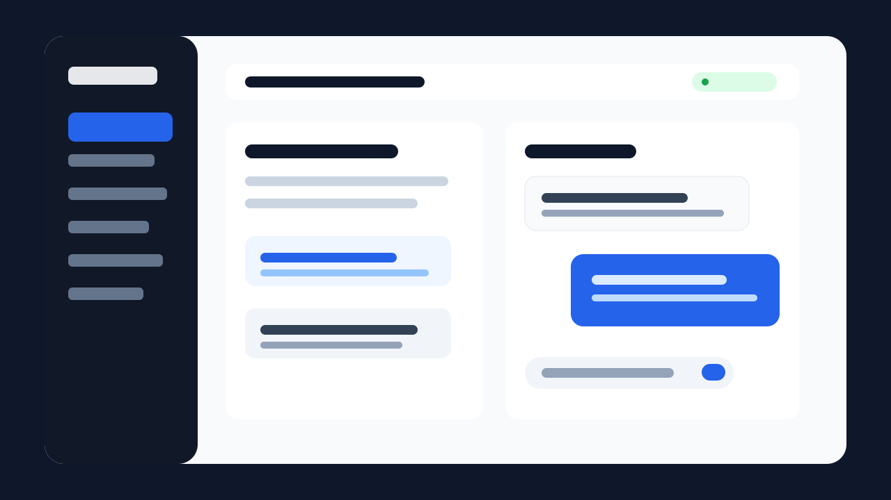

# AI Toolbox

**A local-first AI agent workbench for developers.**

AI Toolbox connects OpenAI-compatible models with a local project knowledge base, reusable developer workflows, cited answers, and file changes that require a diff preview before execution.



```bash
git clone https://github.com/isyakim/AI-TOOLBOX.git
cd AI-TOOLBOX
npm ci
npm run dev
```

## What It Does

- Streams AI chat responses from OpenAI-compatible providers.
- Indexes selected local projects with LanceDB and incremental file hashes.
- Shows source snippets and file paths with project-aware answers.
- Runs ten built-in developer plugins such as PR Review, Test Case Generator, and Release Notes.
- Imports and exports versioned, declarative plugin JSON files with visible permissions.
- Requires a diff preview before write, edit, or delete file actions.
- Restricts file operations to the selected workspace.
- Stores provider credentials with Electron `safeStorage` instead of renderer local storage.

## Product Boundary

AI Toolbox is not a generic collection of AI demos. The supported workflow is:

> Select a project, index it, ask questions with citations, run a reusable developer workflow, review proposed file changes, then explicitly approve execution.

Theme editors, generic tool galleries, arbitrary plugin JavaScript, and unrelated UI generators are intentionally outside this scope.

## Requirements

- Node.js 20+
- npm 10+
- An OpenAI-compatible chat endpoint
- An embedding-capable endpoint for project indexing

## Development

```bash
npm ci
npm run dev
```

Required verification:

```bash
npm run lint
npm run format:check
npm run typecheck
npm run test:unit
npm run test:e2e
npm run build
```

Use `npm run lint:fix` and `npm run format` only when intentionally updating files.

## Architecture

```text
electron/main/       Trusted Electron process, IPC handlers, RAG and workspace policy
electron/preload/    Typed context bridge
src/pages/           Thin application screens
src/components/      Chat, plugin, and layout components
src/services/        AI, RAG, plugin, and speech orchestration
src/shared/          Shared IPC contracts and safe rendering utilities
src/stores/          Pinia application state
plugins/             Repository-owned plugin templates only
tests/unit/          Unit and security tests
e2e/                 Electron Playwright tests
docs/                Architecture, security, and plugin documentation
```

See [Architecture](docs/ARCHITECTURE.md), [Security](SECURITY.md), and [Plugin Schema](docs/PLUGIN_SCHEMA.md).

## 中文说明

AI Toolbox 是一个面向开发者的本地优先 AI Agent 工作台。核心流程是：选择本地项目、建立增量索引、带引用地提问、运行可复用开发插件、预览文件差异并明确批准执行。

项目已主动移除主题编辑器、泛用工具集合、UI 生成器和插件 JavaScript 执行能力，以换取更清晰的产品边界和更可靠的安全模型。

## Contributing

Read [CONTRIBUTING.md](CONTRIBUTING.md). Pull requests must pass the complete verification suite above.

## License

MIT
