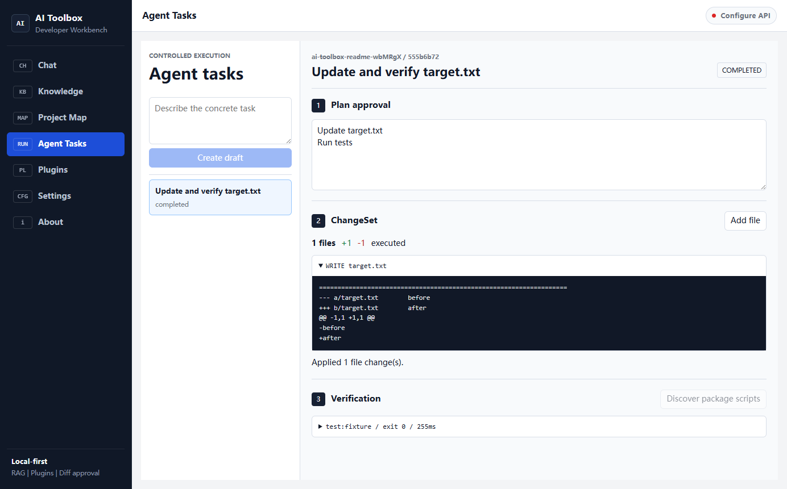
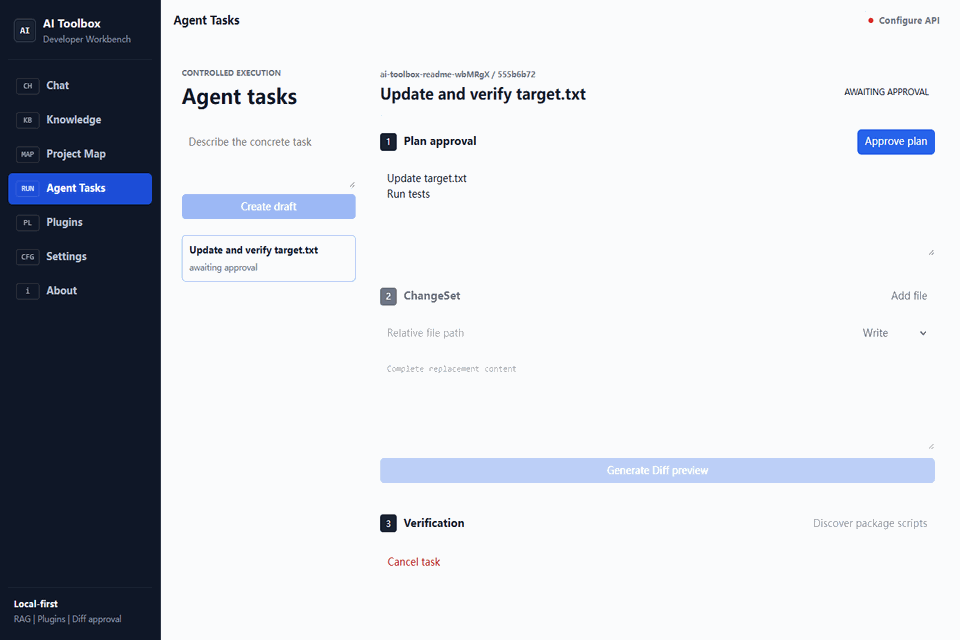

# AI Toolbox

**A local-first AI agent workbench for developers.**

AI Toolbox connects OpenAI-compatible and Ollama models with a local project knowledge base, reusable developer workflows, cited answers, and file changes that require a diff preview before execution.



```bash
git clone https://github.com/isyakim/AI-TOOLBOX.git
cd AI-TOOLBOX
npm ci
npm run dev
```

## What It Does

- Streams AI responses through the trusted Electron main process.
- Supports OpenAI-compatible cloud providers and API-key-free local Ollama models.
- Indexes selected local projects with LanceDB, `.gitignore`, incremental file hashes, and language-aware chunks for TypeScript, JavaScript, TSX, and Vue.
- Builds a Project Map with entry files, symbols, imports, tests, large modules, and coupling hotspots.
- Shows cited source snippets with project identity, file paths, line ranges, symbols, scores, and index timestamps.
- Runs approval-gated Agent tasks through structured plans, multi-file ChangeSets, stale-file hash checks, atomic writes, and allowlisted project verification scripts.
- Loads ten built-in developer workflows from versioned plugin JSON files.
- Requires a diff preview before write, edit, or delete file actions.
- Restricts file operations to the selected workspace.
- Separates public provider settings from credentials encrypted with Electron `safeStorage`.

## Controlled Workflow



## Product Boundary

AI Toolbox is not a generic collection of AI demos. The supported workflow is:

> Select a project, index it, ask questions with citations, approve an Agent plan, review the complete ChangeSet, explicitly approve execution, then run selected project verification scripts.

Theme editors, generic tool galleries, arbitrary plugin JavaScript, and unrelated UI generators are intentionally outside this scope.

## Requirements

- Node.js 22.12+
- npm 10+
- An OpenAI-compatible endpoint or a local Ollama installation
- An embedding-capable model for project indexing

## Development

```bash
npm ci
npm run dev
```

Required verification:

```bash
npm run lint
npm run format:check
npm run typecheck
npm run test:unit
npm run test:e2e
npm run build
```

## Architecture

```text
electron/main/       Trusted AI, credentials, IPC, RAG and workspace policy
electron/preload/    Typed context bridge
src/pages/           Thin application screens
src/components/      Chat, plugin, knowledge and settings components
src/services/        Renderer orchestration without provider credentials
src/shared/          Shared IPC contracts and safe rendering utilities
src/stores/          Pinia application state containing public data only
plugins/             Repository-owned plugin templates and build resources
tests/unit/          Unit and security tests
e2e/                 Electron Playwright tests
docs/                Architecture, security, and plugin documentation
```

See [Architecture](docs/ARCHITECTURE.md), [Security](SECURITY.md), and [Plugin Schema](docs/PLUGIN_SCHEMA.md).

## 中文说明

AI Toolbox 是面向开发者的本地优先 AI Agent 工作台。它支持本地 Ollama 和 OpenAI 兼容服务，可以为本地项目建立隔离索引、生成项目结构图、进行带文件路径和行号引用的问答，并通过计划审批、ChangeSet、文件 hash 校验和受控验证命令执行修改。

项目主动排除了主题编辑器、通用工具集合、UI 生成器和任意插件 JavaScript 执行，以保持清晰的产品边界和可信的安全模型。

## Contributing

Read [CONTRIBUTING.md](CONTRIBUTING.md). Pull requests must pass the complete verification suite above.

## License

MIT
